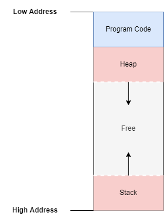
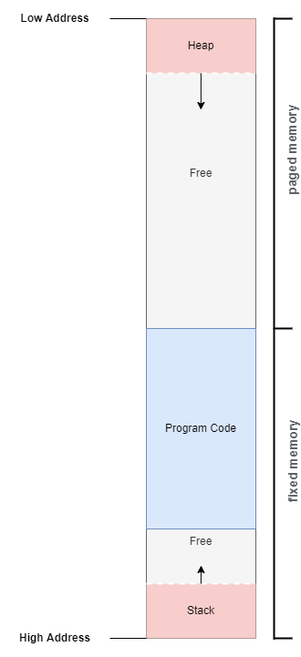
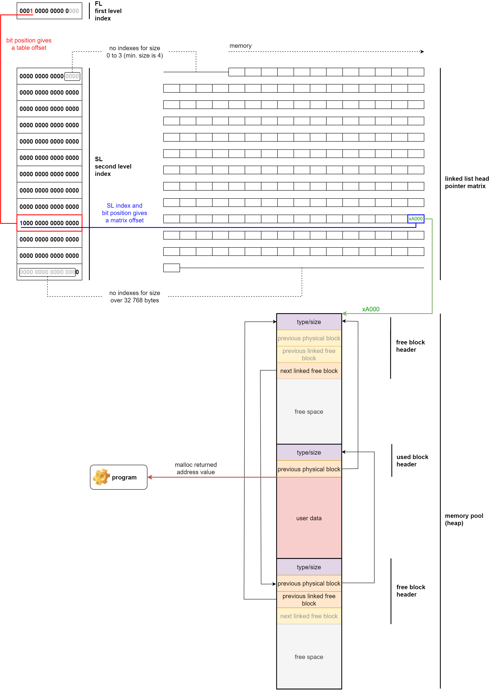
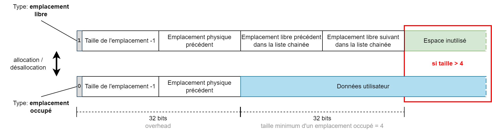
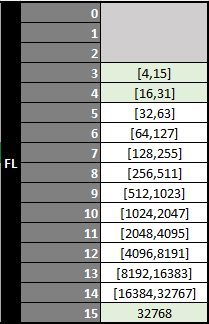
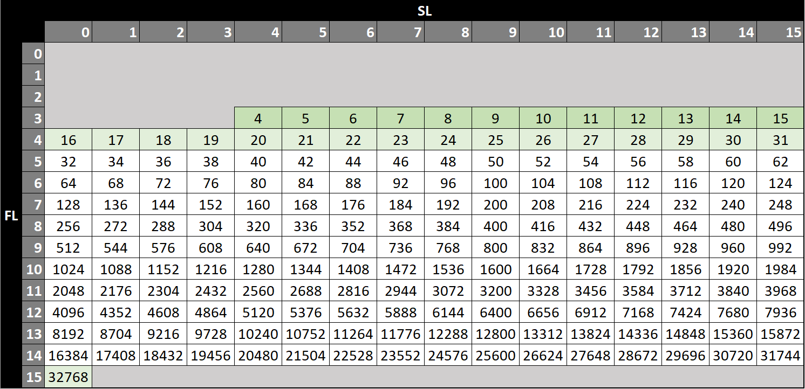

# Allocation dynamique de mémoire pour Motorola 6809

Ce document présente l'implémentation d'un gestionnaire d'allocation mémoire de type TLSF pour le processeur Motorola 6809. La mise en oeuvre a été effectuée sur Thomson TO8, mais il n'y a pas de spécificité particulière liée à ce matériel. Les routines présentées ici fonctionnent sur n'importe quelle ordinateur à base de Motorola 6809.

## Introduction

Il existe plusieurs manières d'utiliser la mémoire vive lors de l'exécution d'un programme.

**la mémoire statique**   
Il s'agit de la mémoire réservée directement dans le binaire du programme au moment de sa génération.   
Exemple de variables en mémoire statique :
```
Addr Binary           Code                  Comments
---- ---------------- --------------------- -------------------------------------------
6312 00               diskid  fcb   $00     ; Disk id
6313 00               nsect   fcb   $00     ; Sector counter
6314 00               track   fcb   $00     ; Track number
6315 00               sector  fcb   $00     ; Sector number
6316                  loaddir
6316 B76312                   sta   >diskid ; Save desired directory id for later check
```

*Contrainte*
- La taille des données est fixée lors de la constitution de l'exécutable.

**la pile (stack)**   
Elle est utilisée pour stocker des variables temporaires lors de l'exécution du programme. Le processeur 6809 possède deux pointeurs de pile : U (User), S (System).
Ces deux piles permettent la sauvegarde ou le chargement des registres du processeur, les cas d'usage les plus courants sont :
- le passage d'arguments à un sous programme
- le stockage de variables temporaires
- la sauvegarde du contexte des registres

La pile S a pour particularité d'être utilisée par le processeur pour sauvegarder le contenu du registre PC (Program Counter) lors de l'appel à une sous-routine, ou pour sauvegarder l'ensemble des registres lors de l'exécution d'une interruption.

Exemple d'utilisation de la pile pour recharger le contexte du code appellant (B, DP, X, U) et retourner au programme appellant (PC) :
```
Addr Binary           Code                  Comments
---- ---------------- ----------------- -------------------
63E6 4F               clra              ; file is not empty
63E7 35DC             puls  b,dp,x,u,pc ; return to caller
```

*Contrainte*
- Il s'agit d'une structure de données de type LIFO (Last In, First Out). On peut bien entendu accéder en lecture et en écriture à tout son contenu de manière indexée, mais pour libérer de la place il faut obligatoirement le faire dans l'ordre inverse de l'insertion des données.

**le tas (heap)**   
Ce concept n'a pas d'implémentation normalisée dans le contexte d'un programme en assembleur 6809. Il s'agit d'un espace mémoire organisé qui peut être géré par un *heap manager*, également appelé *dynamic memory allocator*.

Dans les cas les plus simples, il n'est pas nécessaire d'utiliser un gestionnaire. Il suffit de définir des plages d'utilisation mémoire réservées à certains objets ou fonctions en utilisant des zones suffisament larges et déterminées lors de l'implémentation du code.

Un gestionnaire apporte cependant plus de souplesse au programme, il lui permettra :
- de mutualiser l'espace disponible de manière temporelle, par allocation / désallocation des données
- de charger des données dont il ne connait pas la taille à l'avance, sans surconsommer la mémoire

L'organisation mémoire recommandée est décrite dans le diagramme suivant. Elle permet de mutualiser l'espace mémoire libre entre la pile et le tas.   


Dans le cas de programmes nécessitant une plus grande quantité de mémoire, il peut être pertinent de stocker le tas dans une page mémoire dédiée. Dans ce cas l'organisation serait la suivante :   


*Contrainte*
- L'appel à une routine d'allocation ou de desallocation a un coût non négligeable.
- Un phénomène de fragmentation mémoire apparait au fil des allocations / désallocations, il doit être maitrisé.

## Implémentation de TLSF (Two-Level Segregated Fit)

TLSF est un algorithme dont la complexité en temps des fonctions d'allocation et de désallocation mémoire est O(1). Le temps d'exécution est donc prévisible et ne dépend pas du niveau de fragmentation de la mémoire.

Par exemple, cela signifie qu'il n'y a pas de boucle dans le code pour effectuer la recherche d'un bloc libre d'une taille optimale lors d'une allocation (malloc). Les mécanismes employés permettent d'obtenir ce bloc libre de manière indexée.

Les résultats obtenus en terme de fragmentation mémoire sont proches d'une solution de type "best-fit".

Je vous invite à consulter les documents ci dessous pour une explication détaillée des différents types de gestionnaire d'allocation mémoire et une présentation de TLSF.

*Publications*
- [A constant-time dynamic storage allocator for real-time systems.](doc/paper/jrts2008.pdf) Miguel Masmano, Ismael Ripoll, et al. Real-Time Systems. Volume 40, Number2 / Nov 2008. Pp 149-179 ISSN: 0922-6443.
- [Implementation of a constant-time dynamic storage allocator.](doc/paper/spe_2008.pdf) Miguel Masmano, Ismael Ripoll, et al. Software: Practice and Experience. Volume 38 Issue 10, Pages 995 - 1026. 2008.

### Principe de fonctionnement

Le système d'allocation mémoire TLSF est constitué des éléments suivants :

- **memory pool (heap)**   
    Il s'agit d'une zone de mémoire continue (le tas) dans laquelle sont stockées les données allouées par l'utilisateur. TLSF y stocke également les propriétés des emplacements libres et allouées.

- **linked list head pointer matrix**   
    Cette matrice stocke le point d'entrée de chaque liste chainée référençant les emplacements libres du *memory pool*. Les listes chainées rassemblent des emplacements de tailles similaires.

- **first level bitmap**   
    Le premier niveau d'indexation est stocké sous la forme d'un mot de 16 bits. Chaque bit indique l'existance d'au moins une liste chainée dans le second niveau d'indexation. Le classement s'effectue par puissance de 2 sur la taille de l'emplacement.

- **second level bitmaps**   
    Le second niveau d'indexation utilise un mot de 16 bits pour chaque premier niveau d'indexation. Chaque bit indique l'existance dans la *linked list head matrix* d'une liste chainée contenant des emplacements de mémoire libres. Le classement s'effectue de manière linéaire sur la taille de l'emplacement dans une fourchette définie par le premier niveau d'indexation.

Dans le cadre de la présente implémentation, voici les caractéristiques retenues:

- memory pool : taille admissible entre 8 et 32768 octets dont un minimum de 4 octets d'overhead
- linked list head pointer matrix : 189 pointeurs de 16 bits
- first level bitmap : 16 bits
- second level bitmap : 13x16 bits

Voici une vue globale des données mises en oeuvre dans notre impémentation, n'y cherchez pas une cinématique ou un cas d'usage particulier. L'objectif est de représenter les relations entre les différentes données d'indexation.

On retrouve dans cet exemple un emplacement mémoire déjà alloué et deux emplacements libres, chacun d'une taille équivalente (entre 7936 et 8191 octets inclus), ce qui explique qu'ils soient référencés dans la même liste chainée.




#### Stockage des données dans le *memory pool*

La création d'un emplacement libre dans le *memory pool* s'effectue par l'écriture des données d'entête suivantes à l'adresse de l'emplacement mémoire :

- [ 1 bit ] type d'emplacement (1: libre)
- [15 bits] taille-1 (3-x7FFF)   
- [16 bits] emplacement physique précédent (adresse)
- [16 bits] emplacement libre précédent dans la liste chainée (adresse)
- [16 bits] emplacement libre suivant dans la liste chainée (adresse)

Dans le cas d'un emplacement alloué, l'entête est le suivant :

- [ 1 bit ] type d'emplacement (0: alloué)
- [15 bits] taille-1 (3-x7FFF)   
- [16 bits] emplacement physique précédent (adresse)

Un emplacement libre a une taille minimum de 4 octets, cela permet de transformer un emplacement occupé (entête de taille 4 octets) en emplacement libre (entête de taille 8 octets).

L'espace libre ou alloué est localisé à la suite des entêtes d'emplacement.



Les implémentations de TLSF pour les processeurs 32bits ou plus peuvent utiliser un positionnement du bit de type d'emplacement en début de mot et non en fin (comme proposé ici). Cette solution est pertinente dans le cas où il est nécessaire de garantir un alignement des données (mots de 4 octets par exemple). Cela permet de libérer deux bits non significatifs en début du mot.   
Dans l'implémentation proposée pour le 6809, l'utilisation du bit de signe est préférable car cela permet un test plus rapide du type d'emplacement. D'autre part cela permet de conserver une allocation à l'octet près (au dela du minimum de 4).

#### Stockage des données d'indexation

Lorsqu'un emplacement libre est créé ou supprimé dans le *memory pool*, il est nécessaire de mettre à jour les données d'indexation. 

Voici un exemple de décomposition d'une taille d'emplacement de 781 octets en fonction des index de premier (fl) et second niveau (sl) :
```
0000001 1000 01101 = x030D = 781 octets  
_______ ____
  fl=9  sl=8
(MSB position) (value)
```

L'indexation de premier niveau (fl) s'effectue par classement de la taille de l'emplacement (minimun 4) par puissance de 2 en 13 niveaux, de fl=3 à fl=15.   

Le tableau ci dessous présente les tailles d'emplacement indexées par chaque valeur de premier niveau (fl).   


Ce résultat est obtenu en effectuant deux opérations :
- un appel à la routine Bit Scan Reverse, qui va effectuer le calcul de la position du bit le plus significatif dans la taille de l'emplacement (valeur fl).
- l'application d'un seuil minimum pour la valeur de fl. On utilise la valeur 3 pour toute taille d'emplacement inférieure à 16 (les 4 premiers bits sont utilisés par l'index de second niveau).

L'implémentation de la routine Bit Scan Reverse est la suivante :
```
;-----------------------------------------------------------------
; tlsf.bsr
; input  REG : [tlsf.bsr.in] 16bit integer (1-xFFFF)
; output REG : [B] number of leading 0-bits
;-----------------------------------------------------------------
; Bit Scan Reverse (bsr) in a 16 bit integer,
; searches for the most significant set bit (1 bit).
; Output number is bit position from 0 to 15.
; A zero input value will result in an unexpected behaviour,
; value 0 will be returned.
;-----------------------------------------------------------------
tlsf.bsr.in fdb 0 ; input parameter
tlsf.bsr
        lda   tlsf.bsr.in
        beq   @lsb
@msb
        ldb   #types.WORD_BITS-1
        bra   >
@lsb
            lda   tlsf.bsr.in+1
            ldb   #types.BYTE_BITS-1
!       bita  #$f0
        bne   >
            subb  #4
            lsla
            lsla
            lsla
            lsla
!       bita  #$c0
        bne   >
            subb  #2
            lsla
            lsla
!       bmi   >
            decb
!       rts
```
L'indexation de second niveau (sl) s'effectue par classement lineaire de la taille de l'emplacement en 16 niveaux pour chaque premier niveau (fl).   

**Exemple:** Pour un niveau fl=5, l'ensemble des valeurs indexées par le second niveau sont comprises entre 2^5 et 2^6-1, soit 32 à 63. Il y a 16 niveaux possibles pour sl, donc 32/16=2 valeurs pour chaque niveau sl.
Les valeurs sont donc :
- fl:5,sl:0 [32,33]
- fl:5,sl:1 [34,35]
...
- fl:5,sl:15 [62,63]

Le tableau ci dessous représente chaque couple fl/sl possible. Pour chaque couple on stocke un départ de liste chainée. Cette liste chainée ne contient que des emplacements libres dont la taille minimum est indiquée dans le tableau (la taille maximum n'est pas représentée pour plus de lisibilité, elle correspond à la valeur de la cellule suivante-1).   
Remarque : sont présentés en vert les cas particuliers pour lesquels une indexation exacte a lieu (pas de plage de valeurs).



